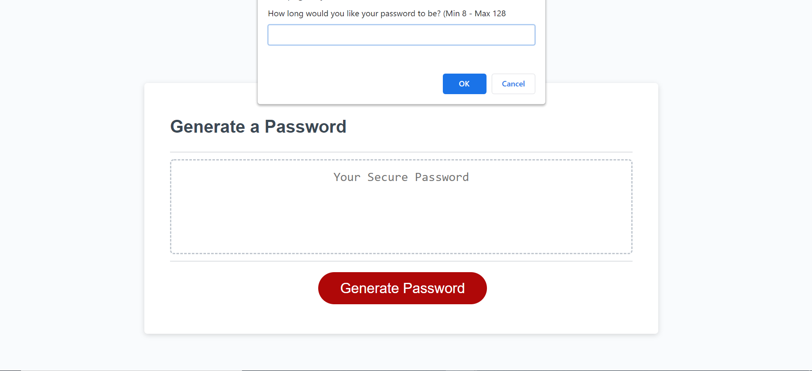
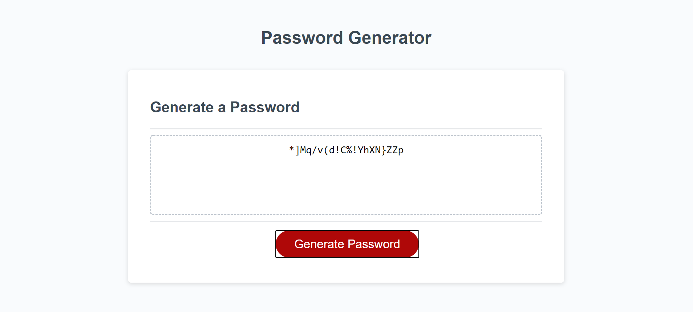

Finished homework assignment for week 3: Password Generator.

Name: Automated Password Generator

The objective of this assignment was to modify starter code to create a website that would automatically create a unique password for a user. The password that is generated will be created based on the certain criteria that the user chooses.  The user can choose to create a password that is between 8 and 128 characters long and will contain at least one of these parameters: lowercase characters, uppercase characters, numeric characters, or special characters.

Live URL:

https://trevorwiegand92.github.io/Automated-Password-Generator/

Github Repository URL:

https://github.com/trevorwiegand92/Automated-Password-Generator

